# Kill Bug Machine — Implementation Plan v2

> **Cross-platform Desktop DevTool** — Crawl, manage, và expose bugs qua MCP cho AI agents tự động xử lý.

---

## 1. Vision & Product Overview

**Kill Bug Machine (KBM)** là một developer productivity desktop app giải quyết 3 vấn đề:

| Problem | Solution |
|:---|:---|
| Bugs nằm rải rác trên nhiều platform | **Unified Crawler** — Thu thập từ GitHub, Jira, GitLab, bất kỳ URL nào |
| Quản lý bugs thiếu context | **Local-first Dashboard** — CRUD đầy đủ, offline, encrypted |
| AI không truy cập được bug data | **MCP Server** — AI agents tự truy vấn, phân tích, fix bugs |

### Target Users
- **Individual Developers** — Quản lý bugs cá nhân, multi-repo
- **Small Teams** — Shared bug database, triage workflow
- **AI-powered Development** — MCP integration cho automated bug fixing

---

## 2. High-Level Architecture

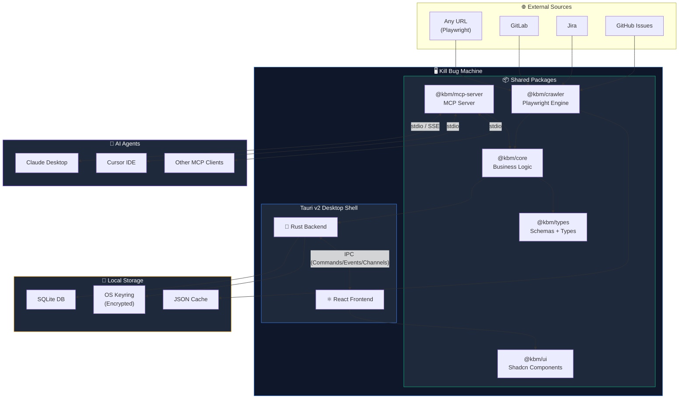

---

## 3. Data Flow & State Management

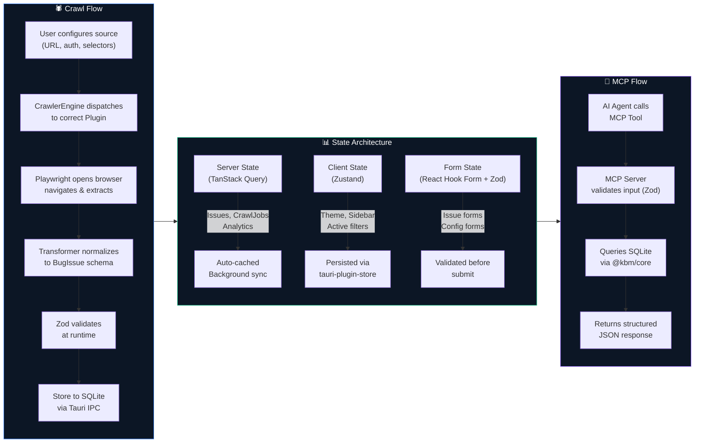

---

## 4. Crawler Plugin Architecture

### 4.1 Plugin System Design

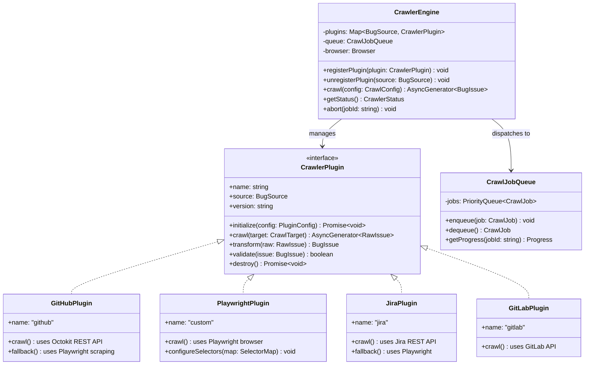

### 4.2 Dual-Mode Crawling Strategy

Mỗi plugin hỗ trợ **2 modes**:

| Mode | Khi nào dùng | Ưu điểm | Nhược điểm |
|:---|:---|:---|:---|
| **API Mode** (Primary) | Có API key, platform hỗ trợ REST/GraphQL | Nhanh, ổn định, structured data | Cần authentication |
| **Playwright Mode** (Fallback/Custom) | Không có API, custom URL, hoặc cần scrape UI | Linh hoạt, hoạt động với mọi website | Chậm hơn, dễ break khi UI thay đổi |

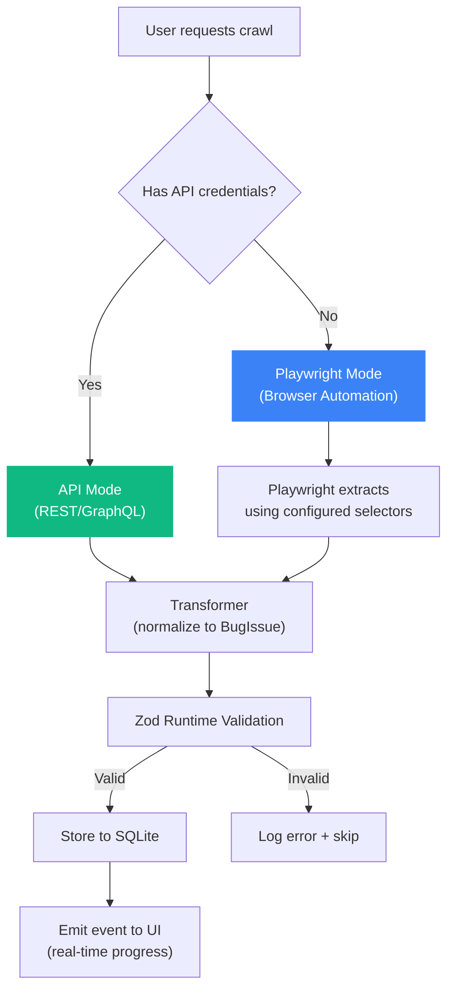

### 4.3 Playwright Crawler Configuration

User có thể configure custom selectors cho bất kỳ website nào:

```typescript
// Ví dụ: Custom selector config cho 1 bug tracker website
interface PlaywrightCrawlConfig {
  /** Base URL to crawl */
  baseUrl: string;
  
  /** Selector map cho page elements */
  selectors: {
    /** Selector cho list page */
    issueList: string;        // e.g., '.issue-row'
    issueLink: string;        // e.g., '.issue-row a.title'
    
    /** Selectors cho detail page */
    title: string;            // e.g., 'h1.issue-title'
    body: string;             // e.g., '.issue-description'
    status: string;           // e.g., '.status-badge'
    severity: string;         // e.g., '.priority-label'
    labels: string;           // e.g., '.label-tag'
    assignee: string;         // e.g., '.assignee-name'
    createdAt: string;        // e.g., 'time.created-date'
    
    /** Pagination */
    nextPage?: string;        // e.g., 'a.next-page'
  };
  
  /** Authentication */
  auth?: {
    type: 'cookie' | 'form-login' | 'header';
    credentials: Record<string, string>;
  };
  
  /** Rate limiting */
  delayMs?: number;           // Delay between requests
  maxConcurrency?: number;    // Max parallel pages
  maxPages?: number;          // Stop after N pages
}
```

---

## 5. Issue CRUD Operations

### 5.1 Full Operations Matrix

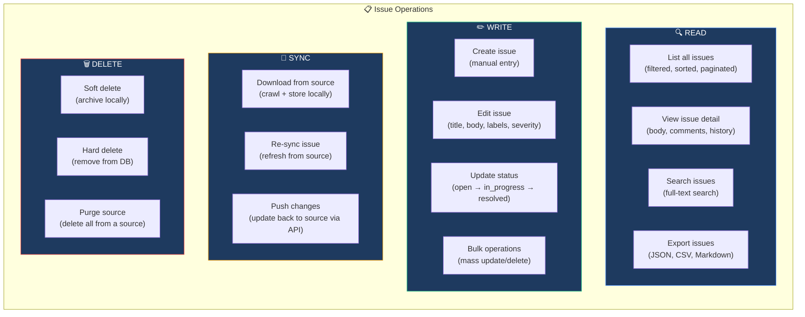

### 5.2 Issue Data Model (Complete)

```typescript
/** Core Issue entity — normalized from all sources */
interface BugIssue {
  // === Identity ===
  id: string;                          // UUID v7 (sortable)
  externalId: string;                  // Original ID from source (e.g., "GH#1234")
  source: BugSource;                   // 'github' | 'jira' | 'gitlab' | 'custom'
  sourceUrl: string;                   // Original URL

  // === Content ===
  title: string;
  body: string;                        // Markdown content
  bodyHtml?: string;                   // Rendered HTML (cached)

  // === Classification ===
  severity: IssueSeverity;             // 'critical' | 'high' | 'medium' | 'low' | 'info'
  status: IssueStatus;                 // 'open' | 'in_progress' | 'resolved' | 'closed' | 'archived'
  labels: string[];
  issueType: IssueType;               // 'bug' | 'feature' | 'task' | 'improvement'

  // === People ===
  author: Person;
  assignees: Person[];

  // === Repository ===
  repository: {
    name: string;
    owner: string;
    url: string;
    platform: BugSource;
  };

  // === Metadata ===
  comments: Comment[];
  attachments: Attachment[];
  relatedIssues: string[];             // IDs of related issues
  milestone?: string;
  
  // === Timestamps ===
  createdAt: string;                   // ISO 8601
  updatedAt: string;
  closedAt?: string;
  lastSyncedAt: string;               // When we last synced from source
  
  // === Local ===
  isLocalOnly: boolean;                // Created locally, not from source
  isModified: boolean;                 // Has local changes not pushed to source
  notes: string;                       // User's private notes
  tags: string[];                      // Local-only tags for organization
}
```

---

## 6. MCP Server Design

### 6.1 MCP Architecture

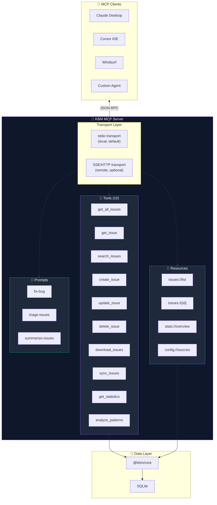

### 6.2 MCP Tools Specification

| # | Tool | Description | Input Schema | Output |
|:--|:---|:---|:---|:---|
| 1 | `get_all_issues` | Lấy danh sách issues có filter & pagination | `{ source?, severity?, status?, labels?, limit?, offset?, sortBy? }` | `BugIssue[]` |
| 2 | `get_issue` | Lấy chi tiết 1 issue kèm comments | `{ id: string }` | `BugIssue` with comments |
| 3 | `search_issues` | Full-text search trong title + body | `{ query: string, source?, severity? }` | `BugIssue[]` |
| 4 | `create_issue` | Tạo issue mới (local hoặc push to source) | `{ title, body, severity, labels[], pushToSource? }` | `BugIssue` |
| 5 | `update_issue` | Cập nhật issue (partial update) | `{ id, title?, body?, status?, severity?, labels?, notes? }` | `BugIssue` |
| 6 | `delete_issue` | Xóa issue (soft/hard) | `{ id, hard?: boolean }` | `{ success: boolean }` |
| 7 | `download_issues` | Trigger crawl job từ URL/source | `{ url: string, source: BugSource, options?: CrawlConfig }` | `{ jobId, issuesFound }` |
| 8 | `sync_issues` | Re-sync issues từ source | `{ source?: BugSource, issueIds?: string[] }` | `{ synced, failed, unchanged }` |
| 9 | `get_statistics` | Thống kê tổng quan | `{ groupBy?: 'source' \| 'severity' \| 'status' \| 'date' }` | `Statistics` |
| 10 | `analyze_patterns` | Phân tích patterns, duplicates, trends | `{ source?, dateRange? }` | `AnalysisResult` |

---

## 7. Security & Credential Storage

### 7.1 Layered Security Architecture

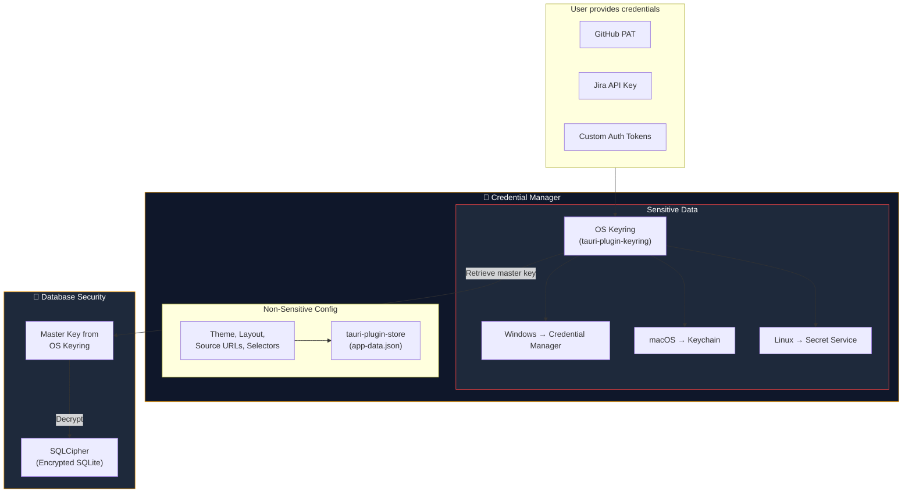

### 7.2 Storage Strategy

| Data Type | Where | Encryption | Example |
|:---|:---|:---|:---|
| **API Tokens, Passwords** | OS Keyring (`tauri-plugin-keyring`) | OS-native (DPAPI on Windows, Keychain on macOS) | GitHub PAT, Jira API key |
| **Database master key** | OS Keyring | OS-native | SQLCipher encryption key |
| **Issue data** | SQLite (SQLCipher) | AES-256 via SQLCipher | Bug titles, bodies, comments |
| **Crawler configs** | `tauri-plugin-store` (JSON) | ❌ Not encrypted | Source URLs, selectors, schedules |
| **App preferences** | `tauri-plugin-store` (JSON) | ❌ Not encrypted | Theme, layout, window state |
| **Crawled HTML cache** | Filesystem (app data dir) | ❌ Not encrypted | Raw HTML snapshots |

---

## 8. UI Design System

### 8.1 Design Language

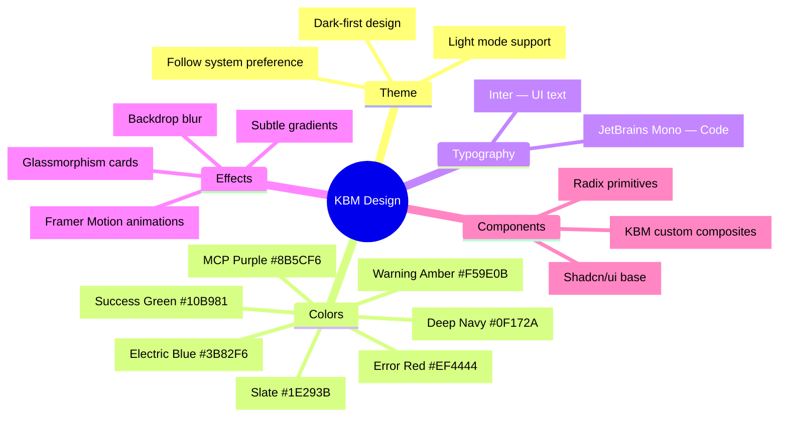

### 8.2 Application Layout

```
┌──────────────────────────────────────────────────────────────────┐
│  ┌─────┐  Kill Bug Machine              🔍 Search   ⚙️  👤     │
│  │ KBM │  ───────────────────────────────────────────────────   │
├──┴─────┴──┬───────────────────────────────────────┬─────────────┤
│           │                                       │             │
│  📊 Dash  │   ┌─────────────────────────────────┐ │  Issue      │
│           │   │                                 │ │  Detail     │
│  🐛 Issues│   │     Main Content Area           │ │  Panel      │
│           │   │                                 │ │             │
│  🕷️ Crawl │   │     (DataTable / Cards /        │ │  ┌───────┐ │
│           │   │      Dashboard / Forms)         │ │  │Title  │ │
│  🤖 MCP   │   │                                 │ │  │Body   │ │
│           │   │                                 │ │  │Labels │ │
│  ⚙️ Config│   │                                 │ │  │Notes  │ │
│           │   │                                 │ │  │Actions│ │
│           │   └─────────────────────────────────┘ │  └───────┘ │
│           │                                       │             │
│  ◀ ▶      │  Showing 1-50 of 234 issues    < 1 2 3 >          │
├───────────┴───────────────────────────────────────┴─────────────┤
│  🟢 MCP: Running  │  🕷️ Last crawl: 5m ago  │  234 issues     │
└──────────────────────────────────────────────────────────────────┘
```

**Layout Features:**
- **Collapsible Sidebar** — Icon-only mode khi thu nhỏ, full labels khi mở rộng
- **Resizable Split Pane** — Kéo thay đổi tỷ lệ giữa list và detail panel
- **Status Bar** — Real-time MCP status, crawler status, issue count
- **Command Palette** — `Ctrl+K` mở quick search/command (giống Raycast/Linear)

### 8.3 Key Pages

| Page | Description | Key Components |
|:---|:---|:---|
| **Dashboard** | Overview: stats cards, timeline chart, source breakdown, recent issues | `StatsCards`, `IssueTimeline` (chart), `SourcePieChart`, `RecentIssuesTable` |
| **Issues** | DataTable with filters, sort, search, bulk actions | `IssueDataTable`, `FilterBar`, `IssueDetailPanel`, `BulkActionToolbar` |
| **Issue Detail** | Full view: markdown body, comments, history, edit form | `MarkdownRenderer`, `CommentThread`, `EditIssueForm`, `ActivityLog` |
| **Crawler** | Configure sources, monitor crawl jobs, view logs | `SourceConfigForm`, `CrawlJobList`, `CrawlProgress`, `SelectorBuilder` |
| **MCP** | Server status, tool list, connection info, live logs | `McpStatusCard`, `ToolRegistry`, `ConnectionConfig`, `LogViewer` |
| **Settings** | Credentials, theme, export/import, about | `CredentialManager`, `ThemeToggle`, `DataExport`, `KeyboardShortcuts` |

---

## 9. Monorepo Structure (Complete)

```
kill-bug-machine/
│
├── 📁 apps/
│   ├── 📁 desktop/                          # Tauri v2 Application
│   │   ├── 📁 src-tauri/                    # Rust backend
│   │   │   ├── 📁 src/
│   │   │   │   ├── main.rs                  # Entry point
│   │   │   │   ├── lib.rs                   # Plugin & command registration
│   │   │   │   ├── 📁 commands/             # Tauri IPC command handlers
│   │   │   │   │   ├── mod.rs
│   │   │   │   │   ├── issues.rs            # Issue CRUD commands
│   │   │   │   │   ├── crawler.rs           # Crawler control commands
│   │   │   │   │   ├── mcp.rs               # MCP server lifecycle commands
│   │   │   │   │   ├── credentials.rs       # Keyring CRUD commands
│   │   │   │   │   └── export.rs            # Export/import commands
│   │   │   │   ├── 📁 db/                   # Database layer
│   │   │   │   │   ├── mod.rs
│   │   │   │   │   ├── connection.rs        # SQLCipher connection pool
│   │   │   │   │   ├── models.rs            # Diesel/SQLx models
│   │   │   │   │   └── 📁 migrations/       # SQL migrations
│   │   │   │   └── 📁 mcp/                  # MCP process manager
│   │   │   │       ├── mod.rs
│   │   │   │       └── spawn.rs             # Spawn/kill MCP child process
│   │   │   ├── Cargo.toml
│   │   │   ├── tauri.conf.json
│   │   │   ├── 📁 capabilities/             # Tauri v2 permission manifests
│   │   │   │   └── main-window.json
│   │   │   └── 📁 icons/
│   │   ├── package.json
│   │   └── vite.config.ts                   # Points to apps/web
│   │
│   └── 📁 web/                              # React + Vite Frontend
│       ├── 📁 src/
│       │   ├── main.tsx                     # Entry point
│       │   ├── 📁 app/                      # App shell
│       │   │   ├── App.tsx                  # Root component
│       │   │   ├── router.tsx               # React Router v7 config
│       │   │   └── providers.tsx            # QueryClient + Theme + Store
│       │   │
│       │   ├── 📁 features/                 # Feature modules (Feature-Sliced)
│       │   │   ├── 📁 dashboard/
│       │   │   │   ├── 📁 components/       # UI components
│       │   │   │   ├── 📁 hooks/            # Feature-specific hooks
│       │   │   │   └── index.ts             # Public API (barrel export)
│       │   │   ├── 📁 issues/
│       │   │   │   ├── 📁 components/
│       │   │   │   │   ├── IssueListPage.tsx
│       │   │   │   │   ├── IssueDetailPanel.tsx
│       │   │   │   │   ├── IssueForm.tsx    # Create/Edit form
│       │   │   │   │   ├── IssueTable.tsx
│       │   │   │   │   ├── IssueFilters.tsx
│       │   │   │   │   └── BulkActions.tsx
│       │   │   │   ├── 📁 hooks/
│       │   │   │   └── index.ts
│       │   │   ├── 📁 crawler/
│       │   │   │   ├── 📁 components/
│       │   │   │   │   ├── CrawlerPage.tsx
│       │   │   │   │   ├── SourceConfigForm.tsx
│       │   │   │   │   ├── SelectorBuilder.tsx  # Visual selector builder
│       │   │   │   │   ├── CrawlJobList.tsx
│       │   │   │   │   └── CrawlProgress.tsx
│       │   │   │   ├── 📁 hooks/
│       │   │   │   └── index.ts
│       │   │   ├── 📁 mcp/
│       │   │   │   ├── 📁 components/
│       │   │   │   ├── 📁 hooks/
│       │   │   │   └── index.ts
│       │   │   └── 📁 settings/
│       │   │       ├── 📁 components/
│       │   │       ├── 📁 hooks/
│       │   │       └── index.ts
│       │   │
│       │   └── 📁 shared/                   # Cross-feature shared
│       │       ├── 📁 components/           # CommandPalette, ErrorBoundary
│       │       ├── 📁 hooks/               # useKeyboardShortcuts, useDebounce
│       │       └── 📁 utils/               # formatDate, cn helpers
│       │
│       ├── index.html
│       ├── package.json
│       ├── vite.config.ts
│       ├── tsconfig.json
│       ├── tailwind.config.ts               # Tailwind CSS 4.0
│       └── components.json                  # Shadcn config
│
├── 📁 packages/
│   ├── 📁 ui/                               # @kbm/ui — Shared Component Library
│   │   ├── 📁 src/
│   │   │   ├── 📁 components/              # Shadcn + custom components
│   │   │   │   ├── 📁 primitives/          # Button, Input, Badge, etc.
│   │   │   │   ├── 📁 composites/          # DataTable, CommandPalette
│   │   │   │   └── 📁 layouts/             # Sidebar, SplitPane, PageShell
│   │   │   ├── 📁 styles/
│   │   │   │   ├── globals.css             # CSS variables, theme tokens
│   │   │   │   └── animations.css          # Keyframe animations
│   │   │   └── 📁 lib/
│   │   │       └── utils.ts                # cn() utility
│   │   ├── package.json
│   │   └── tsconfig.json
│   │
│   ├── 📁 core/                             # @kbm/core — Business Logic
│   │   ├── 📁 src/
│   │   │   ├── 📁 store/                   # Zustand stores
│   │   │   │   ├── issue-store.ts
│   │   │   │   ├── crawler-store.ts
│   │   │   │   ├── settings-store.ts
│   │   │   │   └── index.ts
│   │   │   ├── 📁 queries/                 # TanStack Query hooks
│   │   │   │   ├── use-issues.ts           # Issue CRUD queries/mutations
│   │   │   │   ├── use-crawl-jobs.ts
│   │   │   │   ├── use-statistics.ts
│   │   │   │   ├── query-keys.ts           # Centralized query key factory
│   │   │   │   ├── query-client.ts
│   │   │   │   └── index.ts
│   │   │   ├── 📁 services/                # Integration layer
│   │   │   │   ├── issue-service.ts        # Issue CRUD via Tauri IPC
│   │   │   │   ├── crawler-service.ts      # Crawler commands via IPC
│   │   │   │   ├── credential-service.ts   # Keyring operations via IPC
│   │   │   │   ├── export-service.ts       # JSON/CSV export
│   │   │   │   └── index.ts
│   │   │   └── index.ts
│   │   ├── package.json
│   │   └── tsconfig.json
│   │
│   ├── 📁 crawler/                          # @kbm/crawler — Crawler Engine
│   │   ├── 📁 src/
│   │   │   ├── engine.ts                   # Core CrawlerEngine class
│   │   │   ├── job-queue.ts                # Priority job queue
│   │   │   ├── 📁 plugins/                 # Source-specific plugins
│   │   │   │   ├── plugin-interface.ts     # CrawlerPlugin interface
│   │   │   │   ├── 📁 github/
│   │   │   │   │   ├── github-plugin.ts    # GitHub implementation
│   │   │   │   │   ├── github-api.ts       # Octokit wrapper
│   │   │   │   │   ├── github-scraper.ts   # Playwright fallback
│   │   │   │   │   └── index.ts
│   │   │   │   ├── 📁 playwright/          # Generic Playwright crawler
│   │   │   │   │   ├── playwright-plugin.ts
│   │   │   │   │   ├── selector-engine.ts  # Dynamic selector extraction
│   │   │   │   │   └── index.ts
│   │   │   │   ├── 📁 jira/               # Future: Jira plugin
│   │   │   │   └── 📁 gitlab/             # Future: GitLab plugin
│   │   │   ├── 📁 transformers/            # Data normalization
│   │   │   │   ├── base-transformer.ts
│   │   │   │   └── index.ts
│   │   │   └── index.ts
│   │   ├── package.json
│   │   └── tsconfig.json
│   │
│   ├── 📁 mcp-server/                      # @kbm/mcp-server — MCP Server
│   │   ├── 📁 src/
│   │   │   ├── server.ts                   # MCP server entry
│   │   │   ├── 📁 tools/                   # 10 MCP tools
│   │   │   │   ├── get-all-issues.ts
│   │   │   │   ├── get-issue.ts
│   │   │   │   ├── search-issues.ts
│   │   │   │   ├── create-issue.ts
│   │   │   │   ├── update-issue.ts
│   │   │   │   ├── delete-issue.ts
│   │   │   │   ├── download-issues.ts
│   │   │   │   ├── sync-issues.ts
│   │   │   │   ├── get-statistics.ts
│   │   │   │   ├── analyze-patterns.ts
│   │   │   │   └── index.ts
│   │   │   ├── 📁 resources/               # MCP resources
│   │   │   │   ├── issues-resource.ts
│   │   │   │   ├── statistics-resource.ts
│   │   │   │   └── index.ts
│   │   │   ├── 📁 prompts/                 # MCP prompt templates
│   │   │   │   ├── fix-bug.ts
│   │   │   │   ├── triage-issues.ts
│   │   │   │   ├── summarize-issues.ts
│   │   │   │   └── index.ts
│   │   │   └── index.ts
│   │   ├── package.json
│   │   └── tsconfig.json
│   │
│   ├── 📁 types/                            # @kbm/types — Shared Types
│   │   ├── 📁 src/
│   │   │   ├── 📁 schemas/                 # Zod schemas (runtime validation)
│   │   │   │   ├── issue.schema.ts
│   │   │   │   ├── crawler.schema.ts
│   │   │   │   ├── mcp.schema.ts
│   │   │   │   └── index.ts
│   │   │   ├── 📁 interfaces/              # TypeScript interfaces
│   │   │   │   ├── issue.types.ts
│   │   │   │   ├── crawler.types.ts
│   │   │   │   ├── mcp.types.ts
│   │   │   │   ├── common.types.ts
│   │   │   │   └── index.ts
│   │   │   ├── 📁 enums/                   # Shared enums
│   │   │   │   ├── bug-source.enum.ts
│   │   │   │   ├── issue-severity.enum.ts
│   │   │   │   ├── issue-status.enum.ts
│   │   │   │   └── index.ts
│   │   │   └── index.ts
│   │   ├── package.json
│   │   └── tsconfig.json
│   │
│   └── 📁 config/                           # @kbm/config — Shared Tooling
│       ├── 📁 eslint/
│       │   └── index.mjs                   # ESLint 9 flat config
│       ├── 📁 tsconfig/
│       │   ├── base.json                   # Strict TS base
│       │   ├── react.json                  # React-specific extends
│       │   └── node.json                   # Node/MCP-specific extends
│       ├── 📁 prettier/
│       │   └── index.mjs                   # Prettier config
│       └── package.json
│
├── 📁 .husky/                               # Git hooks
│   ├── pre-commit                          # lint-staged
│   └── commit-msg                          # Commitlint
│
├── .gitignore
├── .prettierrc                              # Points to @kbm/config
├── .eslintrc.mjs                            # Points to @kbm/config
├── package.json                             # Root workspace scripts
├── pnpm-workspace.yaml                      # Workspace definition
├── turbo.json                               # Build pipeline
└── README.md
```

---

## 10. Technology Stack (Final)

| Layer | Technology | Version | Purpose |
|:---|:---|:---|:---|
| **Desktop Shell** | Tauri | v2.x | Lightweight native desktop wrapper |
| **Frontend** | React | 19.x | Component-based UI |
| **Build Tool** | Vite | 6.x | Fast HMR, ESM-native |
| **UI Library** | Shadcn/ui + Radix UI | Latest | Accessible, composable components |
| **Styling** | Tailwind CSS | 4.0 | Utility-first CSS framework |
| **State (Client)** | Zustand | 5.x | Lightweight global state |
| **State (Server)** | TanStack Query | 5.x | Server state, caching, mutations |
| **Forms** | React Hook Form + Zod | Latest | Type-safe form validation |
| **Validation** | Zod | 3.x | Runtime type checking |
| **Routing** | React Router | 7.x | Client-side routing |
| **Animation** | Framer Motion | 12.x | Page transitions, micro-interactions |
| **Charts** | Recharts | 2.x | Dashboard analytics charts |
| **Crawler** | Playwright | Latest | Browser automation for scraping |
| **GitHub API** | Octokit | Latest | GitHub REST/GraphQL client |
| **MCP SDK** | @modelcontextprotocol/sdk | Latest | MCP server implementation |
| **IPC Bindings** | tauri-specta | 2.x | Auto TypeScript types from Rust |
| **Database** | SQLCipher (via rusqlite) | — | Encrypted SQLite |
| **Credentials** | tauri-plugin-keyring | Latest | OS-native keychain |
| **App Config** | tauri-plugin-store | Latest | JSON persistent config |
| **Monorepo** | Turborepo + pnpm | Latest | Build orchestration |
| **Linting** | ESLint 9 + Prettier | Latest | Code quality |
| **Git Hooks** | Husky + lint-staged | Latest | Pre-commit enforcement |
| **Commit** | Commitlint | Latest | Conventional commits |
| **Fonts** | Inter + JetBrains Mono | — | UI + Code typography |
| **Backend** | Rust | Stable | Tauri commands, DB, process mgmt |

---

## 11. Execution Phases

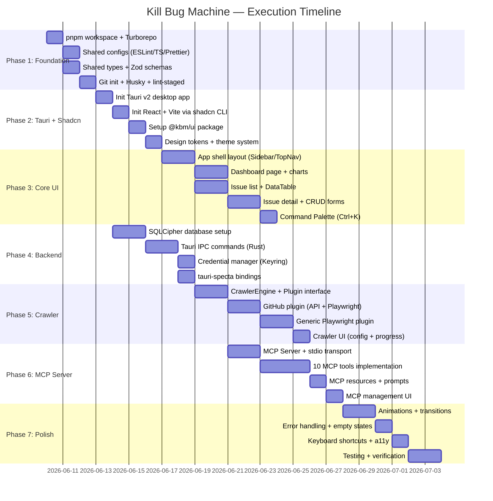

### Phase Details

| Phase | Scope | Deliverables |
|:---|:---|:---|
| **1. Foundation** | Monorepo scaffold, configs, types | Compilable empty workspace, ESLint/TS strict, shared types |
| **2. Tauri + Shadcn** | Desktop app shell, UI package | Tauri window opens, shadcn components available, theme working |
| **3. Core UI** | All frontend pages | Dashboard, Issues CRUD, Crawler config, Settings pages |
| **4. Backend** | Rust backend, DB, IPC | SQLCipher DB, all Tauri commands, credential storage |
| **5. Crawler** | Crawler engine + plugins | GitHub crawler working, Playwright generic crawler |
| **6. MCP Server** | Full MCP implementation | All 10 tools, resources, prompts, stdio transport |
| **7. Polish** | UX, animations, testing | Production-ready app with smooth UX |

---

## 12. Dependency Graph

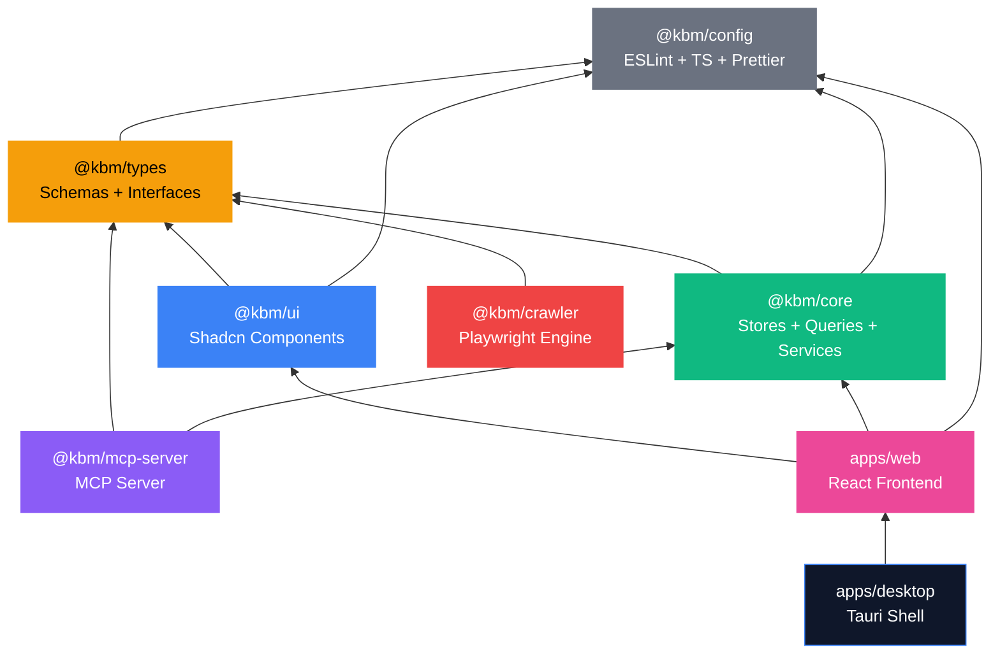

> [!IMPORTANT]
> **No circular dependencies.** Mỗi package chỉ depend vào packages ở layer thấp hơn. `@kbm/types` là foundation, không depend vào bất kỳ package nào khác.

---

## 13. Key Design Decisions

### 13.1 Why Playwright over Pure API?

| Criterion | API Only | Playwright + API (Our Choice) |
|:---|:---|:---|
| **Coverage** | Chỉ platforms có API | Bất kỳ website nào |
| **Auth required** | Luôn cần token | Có thể scrape public data |
| **Custom trackers** | ❌ Không hỗ trợ | ✅ Configurable selectors |
| **Reliability** | Cao | API mode cao, scrape mode trung bình |
| **Extensibility** | Thêm API adapter | Thêm plugin hoặc chỉ cần config selectors |

### 13.2 Why SQLCipher over Plain SQLite?

Developer có thể lưu sensitive bug data (security vulnerabilities, internal bugs). SQLCipher mã hóa toàn bộ database file bằng AES-256, master key lưu trong OS Keyring → **zero plaintext on disk**.

### 13.3 Why Monorepo with Separate Packages?

```
✅ @kbm/mcp-server → Có thể deploy standalone (không cần desktop app)
✅ @kbm/crawler    → Có thể dùng trong CI/CD pipeline
✅ @kbm/ui         → Có thể share cho web version trong tương lai
✅ @kbm/types      → Single source of truth cho mọi package
```

### 13.4 Why Tauri v2 over Electron?

| Metric | Tauri v2 | Electron |
|:---|:---|:---|
| Bundle size | ~3-5 MB | ~150+ MB |
| RAM usage | ~30 MB | ~150+ MB |
| Security | Capability-based, no Node in renderer | Full Node access in renderer |
| Startup | <1s | 2-5s |
| Native APIs | Rust FFI, system keyring | Node.js addons |

---

## 14. Verification Plan

### Automated Tests

```bash
# Type checking toàn bộ workspace
pnpm turbo typecheck

# ESLint strict mode
pnpm turbo lint

# Unit tests (Vitest)
pnpm turbo test

# Build verification
pnpm turbo build

# MCP server test với Inspector
npx @modelcontextprotocol/inspector node packages/mcp-server/dist/index.js
```

### Manual Verification

| Check | Method |
|:---|:---|
| Desktop app launches | `pnpm --filter desktop tauri dev` on Windows |
| Dark/Light theme | Toggle in Settings, verify all pages |
| Issue CRUD | Create → Edit → View → Delete an issue |
| GitHub crawl | Crawl a public repo's issues |
| Playwright crawl | Crawl a custom URL with configured selectors |
| MCP tools | Connect from Claude Desktop, call all 10 tools |
| Encrypted storage | Verify credentials in OS Credential Manager |
| Keyboard nav | Tab through all interactive elements |
| Command palette | `Ctrl+K` → search → navigate |

---

## 15. Future Roadmap (Post-MVP)

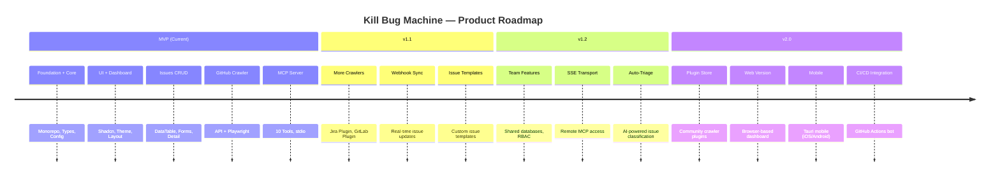
