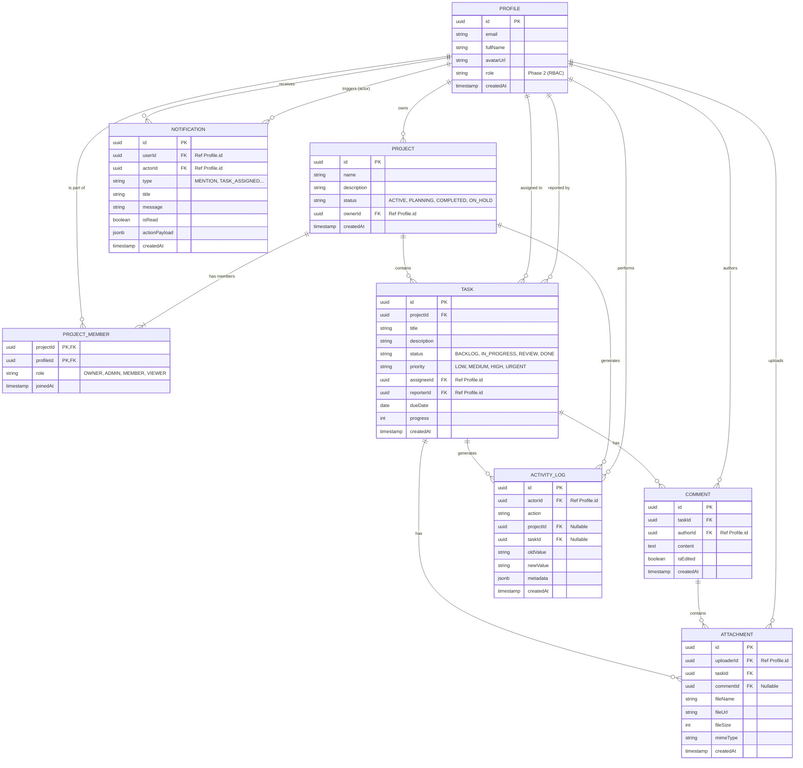

# Overview & Entity Relationship

This document provides a high-level view of how the core domains interact within the system.

## Domain Overview

1.  **Profiles**: Represents the system users. Authentication is handled by Supabase Auth, but the `profiles` table stores application-specific user data and RBAC roles (Phase 2).
2.  **Projects**: The top-level organizational unit. Users belong to projects (many-to-many relationship via ProjectMembers).
3.  **Tasks**: The atomic unit of work, always belonging to a Project and optionally assigned to a Profile.
4.  **Notifications**: System alerts sent to specific Profiles based on events happening in Projects or Tasks.

## Entity-Relationship Diagram (Mermaid)

Below is the conceptual ER diagram representing the relationships between our core DTOs.

## Key Architectural Decisions

-   **Soft Deletes vs Hard Deletes**: Core entities like Projects and Tasks should implement soft deletes (using a `deletedAt` timestamp) to prevent accidental data loss and maintain historical audit trails.
-   **JSONB Payloads**: Notifications use a flexible `actionPayload` JSONB field. This avoids creating rigid schemas for every possible notification trigger, allowing the frontend to dynamically construct links (e.g., routing to `/projects/:projectId/tasks/:taskId`).
-   **Supabase Auth Sync**: The `Profile` schema is designed to mirror the `auth.users` table provided by Supabase. A database trigger should automatically create a `Profile` when a new user signs up.
